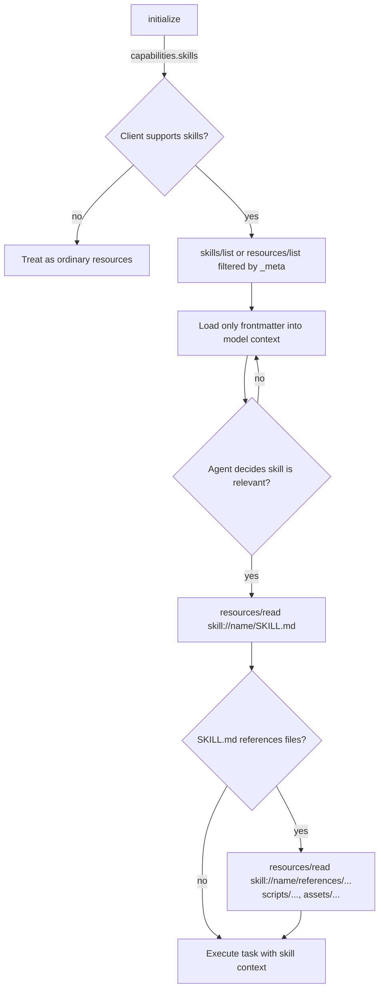

# SEP-0000: MCP Skills - Progressive Disclosure for Servers via Resources

- **Status**: Draft
- **Type**: Standards Track
- **Created**: 2026-05-03
- **Author(s)**: @DevPranjal
- **Sponsor**: None (seeking sponsor)
- **PR**: https://github.com/modelcontextprotocol/modelcontextprotocol/pull/0000

## Abstract

This SEP proposes **MCP Skills**, an optional, backwards-compatible extension that lets MCP
servers expose [Agent Skills](https://agentskills.io) to clients through MCP's existing
**resources** primitive. A skill is a directory containing a `SKILL.md` file with YAML
frontmatter (`name`, `description`, ...) plus optional `scripts/`, `references/`, and `assets/`
subdirectories. By mapping that directory layout onto MCP resources behind a `skill://` URI
scheme — and surfacing only skill _metadata_ during initial discovery — clients can advertise
many server-provided capabilities at near-zero context cost and load full instructions or
referenced files only when a skill is activated.

This bridges the gap that has caused practitioners to abandon MCP servers due to **heavy
context consumption** (every tool, prompt, and resource description is loaded eagerly), while
preserving the strengths of MCP (transport, auth, capability negotiation, sampling, elicitation)
and remaining fully interoperable with the existing Agent Skills ecosystem
([agentskills.io](https://agentskills.io)).

## Motivation

### The context-cost problem with current MCP servers

MCP clients today typically enumerate all tools, prompts, and resources from every connected
server at startup, and inject their full descriptions into the model's context. As servers grow
— and as users connect many servers at once — this becomes a dominant source of context usage,
to the point that some users disable MCP servers entirely or refuse to install large ones.

There is no standard, protocol-level mechanism for a server to say:

> "Here is a _capability_ I can offer. Don't load its full instructions, scripts, or reference
> material until the agent actually decides it is relevant to the task at hand."

### What Agent Skills got right

The Agent Skills specification ([agentskills.io](https://agentskills.io/specification)) solves
exactly this problem on the _agent_ side via **progressive disclosure**:

1. **Metadata** (~100 tokens): only `name` + `description` are loaded for _all_ skills at startup.
2. **Instructions** (< ~5000 tokens): the full `SKILL.md` body is loaded only when the skill is
   activated.
3. **Resources**: files in `scripts/`, `references/`, `assets/` are loaded only on demand.

A skill is just a directory:

```
skill-name/
├── SKILL.md          # required: YAML frontmatter + Markdown instructions
├── scripts/          # optional: executable code
├── references/       # optional: documentation loaded on demand
├── assets/           # optional: templates, data files
└── ...
```

Skills are already supported by a large and growing list of agents (Claude Code, Cursor, GitHub
Copilot, VS Code, Goose, OpenHands, OpenCode, Codex, Gemini CLI, Junie, Letta, ...).

### Why combine them

MCP and Agent Skills are complementary, not competing:

|                              | MCP                                           | Agent Skills                          |
| ---------------------------- | --------------------------------------------- | ------------------------------------- |
| Transport / wire protocol    | Yes (JSON-RPC over stdio / streamable HTTP)   | No — local filesystem only            |
| Auth, sessions, sampling     | Yes                                           | No                                    |
| Discovery from remote source | Yes                                           | No (skills must be installed locally) |
| Progressive disclosure       | No                                            | Yes (metadata → body → references)    |
| Bundled scripts / assets     | Limited (resources, but loaded eagerly today) | First-class (`scripts/`, `assets/`)   |

Today users have to choose. A team that wants to ship a "PDF processing skill" must either:

- Publish it as a local Agent Skill — losing remote distribution, auth, and central updates; or
- Build a heavyweight MCP server — paying full context cost on every session.

This SEP proposes a single, minimal addition that lets a server **publish skills over MCP** and
lets a client **load them progressively**, so users get the best of both.

## Specification

### Overview

A server that opts into this extension exposes one or more **skills** via MCP resources. Each
skill is rooted at a `skill://` URI and follows the Agent Skills directory layout. Clients that
support the extension list skills cheaply (metadata only), then fetch the `SKILL.md` body and
any referenced files on demand using ordinary `resources/read` calls.

This is a pure layering on top of existing MCP primitives. No new RPC methods are required for
the minimum viable version; the contract is:

1. A new **capability** advertised during initialization.
2. A new **URI scheme** (`skill://`) with a defined directory shape.
3. A new **`_meta` marker** identifying skill resources and conveying skill frontmatter.
4. A new optional **`skills/list`** convenience method that returns parsed skill metadata for
   all available skills in one call.

### 1. Capability negotiation

Servers and clients that support this extension MUST advertise it in their capabilities during
`initialize`:

```json
{
  "capabilities": {
    "skills": {
      "listChanged": true
    }
  }
}
```

- `skills.listChanged` (optional, boolean): if `true`, the server will emit
  `notifications/skills/list_changed` when its set of available skills changes (e.g., a skill
  is published or removed).

A server MAY expose skill resources without advertising the capability for backwards
compatibility, but clients are not required to discover them in that case.

### 2. The `skill://` URI scheme

Each skill is identified by a URI of the form:

```
skill://{name}/SKILL.md
skill://{name}/scripts/{path}
skill://{name}/references/{path}
skill://{name}/assets/{path}
```

Where `{name}` MUST conform to the Agent Skills `name` rules (1–64 chars,
`[a-z0-9-]`, no leading/trailing or consecutive hyphens) and MUST equal the value of the
`name` field in the corresponding `SKILL.md` frontmatter.

The root manifest of a skill is always `skill://{name}/SKILL.md`. All other paths within the
skill are resolved relative to the skill root, exactly as in the Agent Skills spec.

### 3. The `_meta` marker

Every resource that participates in a skill MUST include the following entry in its `_meta`
field (using a vendor prefix per [SEP-2133 (Extensions)](./2133-extensions.md)):

```json
{
  "uri": "skill://pdf-extractor/SKILL.md",
  "name": "PDF Extractor",
  "mimeType": "text/markdown",
  "_meta": {
    "io.modelcontextprotocol/skill": {
      "name": "pdf-extractor",
      "role": "manifest"
    }
  }
}
```

`role` is one of:

| `role`      | Applies to                                      | Loaded when         |
| ----------- | ----------------------------------------------- | ------------------- |
| `manifest`  | The `SKILL.md` file                             | On skill activation |
| `script`    | Files under `scripts/`                          | On demand           |
| `reference` | Files under `references/`                       | On demand           |
| `asset`     | Files under `assets/` (templates, images, data) | On demand           |

For `manifest` resources, the server SHOULD additionally include the parsed frontmatter under
`io.modelcontextprotocol/skill.frontmatter` so that clients can perform skill selection
**without reading the resource body**:

```json
"_meta": {
  "io.modelcontextprotocol/skill": {
    "name": "pdf-extractor",
    "role": "manifest",
    "frontmatter": {
      "name": "pdf-extractor",
      "description": "Extracts structured data from PDF invoices and receipts. Use when the user asks to parse, summarize, or pull line items from PDF documents.",
      "license": "MIT",
      "compatibility": "Requires Python 3.11; network access not required."
    }
  }
}
```

The `frontmatter` block MUST be a faithful representation of the YAML frontmatter in
`SKILL.md` and MUST validate against the Agent Skills frontmatter rules (e.g. `description` ≤
1024 chars).

### 4. Discovery and progressive disclosure

The disclosure ladder mirrors the Agent Skills model:



Concretely:

1. **Step 1 — Metadata only.** The client lists skills cheaply. It MAY use either
   `resources/list` and filter by `_meta["io.modelcontextprotocol/skill"].role == "manifest"`,
   or call the convenience method `skills/list` (see §5). Only frontmatter (not the Markdown
   body) is exposed to the model. Per the Agent Skills spec this is ~100 tokens per skill.
2. **Step 2 — Instructions on activation.** When the agent picks a skill, the client calls
   `resources/read` on `skill://{name}/SKILL.md` and supplies the body to the model.
3. **Step 3 — Bundled files on demand.** As the model follows references inside `SKILL.md`
   (e.g. "see `references/REFERENCE.md`", "run `scripts/extract.py`"), the client resolves
   those relative paths against the skill root and reads them via `resources/read`.

Servers SHOULD keep `SKILL.md` bodies under ~5000 tokens and push detail into `references/`,
in line with the Agent Skills authoring guidance.

### 5. `skills/list` (convenience method)

To avoid forcing clients to filter `resources/list` and parse `_meta`, servers SHOULD also
expose a convenience method:

**Request**

```json
{
  "jsonrpc": "2.0",
  "id": 1,
  "method": "skills/list",
  "params": { "cursor": "optional-pagination-cursor" }
}
```

**Response**

```json
{
  "skills": [
    {
      "name": "pdf-extractor",
      "uri": "skill://pdf-extractor/SKILL.md",
      "frontmatter": {
        "name": "pdf-extractor",
        "description": "Extracts structured data from PDF invoices and receipts...",
        "license": "MIT",
        "compatibility": "Requires Python 3.11; network access not required."
      }
    }
  ],
  "nextCursor": null
}
```

The response MUST contain only the parsed frontmatter for each skill — never the `SKILL.md`
body or any bundled file. This is the protocol-level guarantee that _listing_ a skill never
leaks more than ~100 tokens of context per skill.

### 6. Notifications

When `skills.listChanged` is `true`, the server MAY emit:

```json
{
  "jsonrpc": "2.0",
  "method": "notifications/skills/list_changed"
}
```

Clients SHOULD re-call `skills/list` (or the equivalent filtered `resources/list`) on receipt.

### 7. Relationship to tools and prompts

A skill MAY reference MCP tools provided by the same server in its `SKILL.md` body. If a skill
intends to constrain the agent to a particular set of tools, it SHOULD use the existing
`allowed-tools` frontmatter field (experimental in the Agent Skills spec) and use the
fully-qualified MCP tool name. This SEP does not introduce a new tool-gating mechanism.

### 8. Compatibility with local Agent Skills

A `skill://...` resource tree is structurally identical to a local skill directory. A client
that already supports local Agent Skills MAY treat a remote skill as if the server's resources
were a virtual filesystem rooted at the skill name. Conversely, a server MAY publish an existing
local skill directory verbatim by mapping each file to a `skill://` URI without modification.

## Rationale

### Why reuse `resources` instead of inventing a new primitive?

MCP already has a primitive for "named, addressable, fetchable content with a MIME type and
metadata" — that is exactly what a skill's files are. Building on `resources` means:

- Existing servers and SDKs already implement read, list, subscribe, pagination.
- Auth, transport, and capability negotiation come for free.
- Clients that don't understand the `skills` capability still see plain resources (graceful
  degradation).

The alternative — defining a brand-new `skills/read`, `skills/list`, `skills/files` family of
methods that duplicates resource semantics — was rejected as needless surface area.

### Why the `skill://` scheme instead of overloading existing schemes?

Tools like SEP-1865 (MCP Apps) introduce `ui://` to make the _intent_ of a resource visible
from its URI. The same reasoning applies here: a `skill://` prefix makes it trivially obvious to
clients, proxies, and humans that a resource participates in a skill, without requiring them to
inspect `_meta`. Servers that wish to back skills with files from another scheme (e.g.
`file://`) can still do so by issuing `skill://` URIs that the server resolves internally.

### Why expose frontmatter in `_meta` and in `skills/list`?

The single most important property of progressive disclosure is that **listing must be cheap**.
If clients had to `resources/read` every `SKILL.md` to know what each skill is for, the
extension would defeat its own purpose. Putting frontmatter on the listing path guarantees
constant per-skill cost regardless of body size.

### Alternatives considered

- **A separate `skill` primitive at the same level as `tools`/`resources`/`prompts`.**
  Cleaner conceptually, but doubles the wire surface, requires SDK work in every language, and
  loses the "free graceful degradation" property.
- **Inline skills in tool annotations.** The Agent Skills format intentionally separates
  metadata from body specifically to enable disclosure tiers; collapsing them back into a
  single tool annotation would lose that.
- **Just tell users to install Agent Skills locally.** Solves context cost but loses MCP's
  remote distribution, central update story, auth, and ability to ship server-side updates
  without a user-side reinstall.

## Backward Compatibility

This proposal is a **fully optional, additive extension**.

- Servers that do not implement it are unaffected.
- Clients that do not implement it see ordinary resources (with an unfamiliar `_meta` block
  that they MUST ignore per existing rules) and an unfamiliar `skill://` URI scheme. They MAY
  ignore both safely.
- No existing MCP method changes shape. `skills/list` and the `skills` capability are net-new.

There are no backward-incompatible changes.

## Security Implications

Skills are _executable knowledge_: when activated, their `SKILL.md` body is fed directly to the
model and may instruct it to run scripts, follow links, or invoke tools. Clients MUST treat
remote skills with the same caution as remote tools.

Specific considerations:

- **Prompt-injection surface.** Anything a server places in `SKILL.md`, `references/`, or
  `assets/` that the client passes to the model is trusted by the model in the same sense that
  tool descriptions are. Clients SHOULD surface skill activation to the user (e.g. "Server X
  proposes activating skill _pdf-extractor_") and SHOULD allow per-skill enable/disable in
  the same UI surface used for tool consent.
- **Script execution.** `scripts/` resources are _content_, not RPC: the server returns code,
  the client decides whether and how to execute it. Clients MUST NOT execute `scripts/` files
  automatically without applying the same sandboxing and consent gates they apply to local
  Agent Skills' `scripts/`.
- **`compatibility` field.** Clients SHOULD parse `frontmatter.compatibility` and refuse
  activation when stated requirements are not met (e.g. required interpreter missing, network
  access disallowed) rather than letting the model discover the failure mid-task.
- **Frontmatter validation.** Servers MUST emit frontmatter that conforms to the Agent Skills
  rules (`name` regex, `description` ≤ 1024 chars, `compatibility` ≤ 500 chars). Clients MUST
  reject skills whose `_meta.frontmatter.name` does not match the `{name}` segment of the URI,
  to prevent a malicious server from impersonating another skill in the UI.
- **Resource size limits.** Because activation triggers a `resources/read`, clients SHOULD
  enforce a maximum body size for `SKILL.md` (the spec recommends < ~5000 tokens) and SHOULD
  cap the cumulative size of files pulled in via references to mitigate context-flood attacks.

## Reference Implementation

A reference implementation is not yet available. The intended deliverables before this SEP can
move to `Final` are:

1. A small TypeScript SDK helper (`@modelcontextprotocol/sdk` extension) that:
   - Lets servers register a directory of skills with one call (`server.registerSkillsDir(...)`)
     and automatically generates the `skill://` resources, `_meta` markers, and `skills/list`
     handler.
   - Lets clients subscribe to `skills/list` and resolve relative references inside `SKILL.md`
     against the skill root.
2. A demonstrator MCP server that publishes a few skills from
   [agentskills.io](https://agentskills.io)'s example catalog over MCP, verifying that the
   same `SKILL.md` files work both locally and remotely with no edits.
3. Validation that the cumulative listing cost for _N_ published skills is bounded by
   ~`N × 100` tokens, matching the Agent Skills disclosure budget.

## Open Questions

- Should `skills/list` support filtering (e.g. by tag in `metadata`) at the protocol level, or
  is client-side filtering on `frontmatter` sufficient?
- Should there be a standard way for a _client_ to publish its own skills _to_ a server (e.g.
  for a server-side agent to use), or is the directionality strictly server → client?
- Should the frontmatter `allowed-tools` field be normatively scoped to MCP tool names from the
  same server, or allowed to reference tools from any connected server?

## Acknowledgments

Thanks to the Agent Skills authors and the broader [agentskills.io](https://agentskills.io)
community for the directory format and the progressive-disclosure model that this SEP builds
on, and to the authors of SEP-1865 (MCP Apps) and SEP-2133 (Extensions) for establishing the
patterns of `*://` URI schemes and `_meta`-based extension markers reused here.
